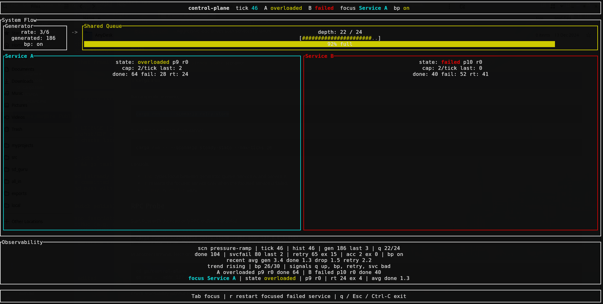
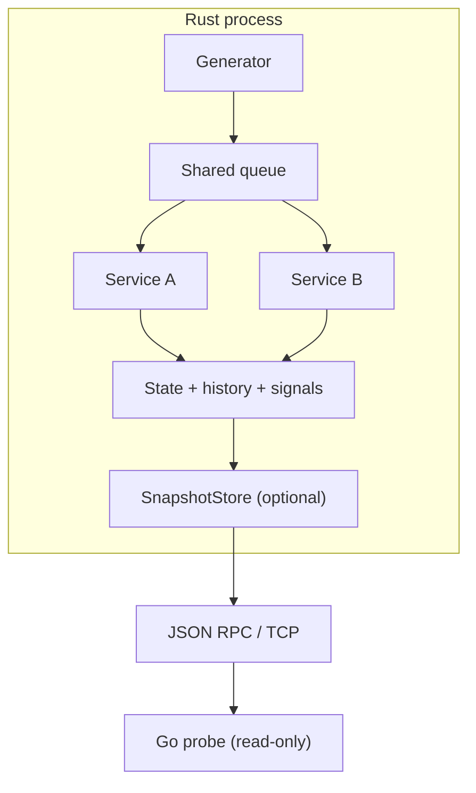

# request-pipeline-sim

Deterministic simulation of a small **request pipeline**  under load and failure, with a terminal UI and an optional read-only RPC boundary. Rust owns all simulation state and mutation; a Go program can **observe** snapshots over TCP but does not drive the sim.

This project explores how such a pipeline behaves under load and failure without real infrastructure. The Go side is intentionally a **read-only observer probe**, not an orchestrator.

## Demo

<p align="center">
  
</p>

Terminal simulation of a small request-processing data plane with a separate
read-only observer probe (Go).

The Rust process owns the simulation, terminal UI, and all state mutation. It
runs a deterministic tick loop for one request generator, one bounded shared
queue, and two services. The optional RPC listener exposes read-only snapshots
over newline-delimited JSON on TCP. The Go program is a probe that connects to
that boundary and prints one snapshot.

## What It Demonstrates

- Deterministic simulation ticks with repeatable built-in scenarios
- Generator -> shared bounded queue -> two service workers
- Queue overflow accounting for dropped requests
- Bounded retries when failed services are offered work
- Backpressure when queue pressure is sustained
- Overload, failure, low-pressure recovery, and manual focused restart
- Rolling in-process history with recent averages and status signals
- A read-only Rust/Go boundary where Go observes but does not control execution

## Architecture

Rust is the data plane and execution owner:

- owns simulation state and counters
- runs the tick loop
- renders the TUI
- applies retries, backpressure, overload, recovery, and restart behavior
- optionally publishes a snapshot copy for RPC readers

Go is an **observer probe** (read-only):

- dials the Rust TCP endpoint
- sends `Ping` or `GetSimulationSnapshot`
- prints the response
- does not schedule, route, restart, scale, or mutate the simulation

RPC is not part of the simulation tick loop. Each tick updates local Rust state
first. When RPC is enabled, the app copies the current state into a
`SnapshotStore` after ticks and focused restarts. RPC clients read that snapshot
copy.



Dispatch: Service A is offered work first each tick, then Service B; the shared queue is bounded.

## Core Mechanics

- **Dispatch:** queued work is offered to Service A first, then Service B, each
  tick.
- **Retries:** a failed service consumes offered work up to its capacity. Work is
  returned to a retry buffer until its retry limit is exhausted.
- **Backpressure:** when the queue remains at least 75% full for the configured
  threshold, generation drops to half rate, with a minimum of one request per
  tick when generation is nonzero.
- **Recovery:** overloaded services recover after the queue remains below
  pressure for the configured recovery window.
- **Manual restart:** failed services do not recover automatically. Focus
  Service A or Service B and press `r` to restart that failed service.
- **History:** the simulation keeps a bounded recent history and derives recent
  averages, queue trend, backpressure count, and status signal identifiers.

## Scenarios

List the scenario names supported by the binary:

```sh
cargo run -- --list-scenarios
```

Current scenarios:

| Scenario | Purpose |
| --- | --- |
| `steady-state` | Balanced load that should remain healthy |
| `pressure-ramp` | Sustained pressure that fills the queue over time |
| `retry-storm` | Failed services create bounded retry pressure |
| `dual-failure` | Aggressive load drives both services to failure |

## Run

Run the TUI with the default `steady-state` scenario:

```sh
cargo run
```

Run a specific scenario:

```sh
cargo run -- --scenario retry-storm
```

Run a short automated simulation:

```sh
cargo run -- --scenario steady-state --max-ticks 20
```

Controls:

- `Tab` cycles focus between generator, queue, Service A, and Service B.
- `r` restarts the focused service only when the focused service is failed.
- `q`, `Esc`, or `Ctrl-C` exits.

## RPC probe

Start Rust with the read-only RPC endpoint enabled:

```sh
cargo run -- --scenario retry-storm --rpc-addr 127.0.0.1:4707
```

In another terminal, fetch one snapshot with the Go probe:

```sh
cd go/probe
go run . -addr 127.0.0.1:4707
```

Check reachability without fetching a snapshot:

```sh
cd go/probe
go run . -addr 127.0.0.1:4707 -ping
```

The RPC transport is newline-delimited JSON over TCP. Supported requests are:

```json
{"method":"GetSimulationSnapshot"}
```

```json
{"method":"Ping"}
```

Snapshot responses include:

- scenario and tick
- queue depth and maximum queue size
- backpressure state
- total generated, accepted, processed, dropped, retried, retry-exhausted, and
  failed-in-service counts
- recent summary values
- Service A and Service B state and counters
- status signal identifiers

## Demo flows

Steady-state baseline:

```sh
cargo run -- --scenario steady-state
```

Watch the queue, services, and recent averages settle under balanced load.

Retry-storm with the observer probe:

```sh
cargo run -- --scenario retry-storm --rpc-addr 127.0.0.1:4707
```

Then, from another terminal:

```sh
cd go/probe
go run . -addr 127.0.0.1:4707
```

Run the Go command repeatedly to sample the current Rust-owned snapshot.

## Repo structure

- `src/main.rs` - CLI parsing, TUI lifecycle, tick loop, snapshot publication
- `src/simulation.rs` - simulation state, dispatch, retries, backpressure,
  service state transitions, history, status signals
- `src/scenario.rs` - deterministic scenario presets
- `src/ui.rs` - terminal rendering and focused controls
- `src/rpc.rs` - read-only TCP JSON snapshot server
- `go/probe/` - Go probe for `Ping` and `GetSimulationSnapshot`

## Verify

```sh
cargo fmt
cargo test
cargo run -- --max-ticks 5
cargo run -- --list-scenarios
```

For the Go probe:

```sh
cd go/probe
go test ./...
```

## Intentionally out of scope

- Write actions or orchestration policies from the Go side
- RPC restart, routing, scaling, or scheduling methods
- Logs, traces, metrics integrations, or external observability systems
- External configuration systems or scenario scripting
- Authentication or external security controls for the local RPC endpoint
- More services, larger topologies, load balancers, caches, databases, or
  firewalls
- Replacing the JSON/TCP RPC boundary with another transport

## Future work

- Add a multi-node simulation mode with routing and basic load balancing across nodes.
- Extend observability with latency views and error-distribution summaries in snapshots.
- Evolve the Go probe into a component that can issue controlled write actions (restart, routing changes) while preserving separation from the simulation loop.
- Expand scenario presets to cover additional traffic shapes and failure patterns.
